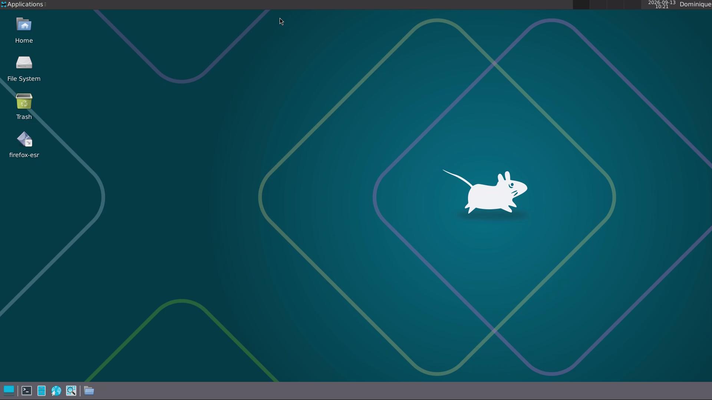

# Linudex

[Português](README.pt.md)

Linudex is a repurposing project that turns a Samsung Galaxy S10+ with a damaged display into a compact ARM desktop environment. The current software stack keeps Samsung DeX and Android as the hardware/driver layer, while Termux, PRoot-Distro, Debian and XFCE provide a Linux desktop environment.

## v0.1.0 — Functional Linux Desktop

Version `v0.1.0` marks the first stable graphical Linux milestone. At this stage, Linudex can boot Debian 13 ARM64 with XFCE through Termux:X11 and remain stable under the tested desktop workloads.

## v0.2.0 — Daily Driver Environment

Version `v0.2.0` builds on the stable Linux desktop established in v0.1.0 and turns it into a more practical daily-use environment. Audio, shared storage, desktop tuning, essential applications and startup automation are now integrated into the Linudex workflow.

## v0.2.1 - Automatic Startup Fix

Version `v0.2.1` is an update that fixes an auto-start bug in Linudex caused by an error when trying to run PulseAudio during a cold boot.

### Completed

- Android shared storage integrated with Debian.
- PulseAudio bridge configured between Debian applications, Termux and Android/DeX.
- XFCE tuned for 1920×1080 use with 115 DPI and compositor disabled.
- Desktop panel, Whisker Menu and application shortcuts configured.
- Essential desktop applications installed and validated, including Firefox ESR, LibreOffice, VLC, Evince and archive utilities.
- Office-compatible fonts and Brazilian Portuguese language/spell-check support installed.
- `start-linudex.sh` and `stop-linudex.sh` expanded to manage audio, Termux:X11 and the Debian/XFCE session.
- Termux:Boot configured for automatic Linudex startup after Android boot.
- Termux:Widget configured for manual start/stop control when needed.
- Termux:X11 configured to open automatically when Linudex starts.

## Architecture

```text
Samsung Galaxy S10+
└── Android 12 / One UI 4.1
    ├── Samsung DeX
    ├── Termux:Boot / Termux:Widget
    └── Termux
        ├── PulseAudio
        ├── Termux:X11
        └── PRoot-Distro
            └── Debian 13 ARM64
                └── XFCE
```

This design intentionally keeps Android because it provides mature hardware support for the Galaxy S10+, including USB-C video output, audio routing and Samsung DeX. Debian runs as a userspace environment over the Android kernel rather than as a virtual machine.

## Current status

Linudex `v0.2.0` is the daily-driver software milestone. The Linux environment can start automatically after Android boot and now provides storage integration, audio, office applications, web browsing and the basic utilities expected from a lightweight desktop.

Final keyboard/mouse tuning, cold-boot validation directly into Samsung DeX over the final HDMI setup, and the physical enclosure/cooling build remain dependent on the final hardware configuration.

<p align="center">
  
</p>

## Documentation

- [System baseline](docs/baseline.md)
- [Architecture](docs/architecture.md)
- [Android debloat](docs/debloat.md)
- [Software setup](docs/software.md)
- [Hardware](docs/hardware.md)
- [Benchmarks](docs/benchmarks.md)
- [Troubleshooting](docs/troubleshooting.md)
- [Bill of materials](bom/components.md)

## Repository layout

```text
linudex/
├── README.md
├── README.pt.md
├── docs/
│   ├── architecture.md
│   ├── baseline.md
│   ├── benchmarks.md
│   ├── debloat.md
│   ├── hardware.md
│   ├── software.md
│   └── troubleshooting.md
├── images/
│   ├── benchmarks/
│   ├── build/
│   ├── diagrams/
│   └── screenshots/
├── scripts/
├── configs/
└── bom/
```

Every Markdown document has a Portuguese counterpart using the `*.pt.md` suffix.

## Image organization

Use the image folders by purpose:

- `images/build/` — physical build progress, enclosure, hub and cooling assembly.
- `images/screenshots/` — DeX, Termux, Debian and XFCE screenshots.
- `images/benchmarks/` — benchmark captures and charts.
- `images/diagrams/` — architecture, airflow and wiring diagrams.

Avoid placing screenshots directly in `docs/`; documentation should reference the corresponding file under `images/`.

## Project scope

Linudex is an experimental reuse project. The goal is not to replace a conventional x86 PC in every workload, but to evaluate how far a damaged but functional flagship smartphone can be repurposed as a low-cost ARM desktop.

<p align="center">
  
</p>

## License

This project is free software: you can redistribute it and/or modify it under the terms of the GNU General Public License as published by the Free Software Foundation, either version 3 of the License, or (at your option) any later version.

The diagrams, images, and textual documentation contained in this repository are also protected under the same terms of the GNU GPL v3.
