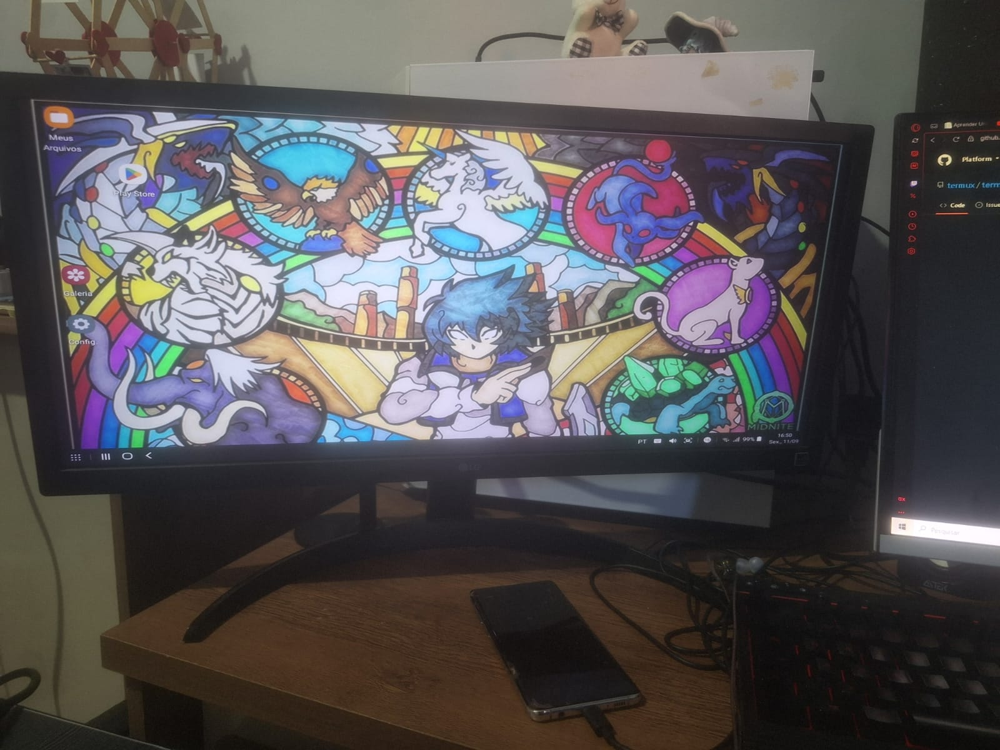

# Linudex

[Português](README.pt.md)

Linudex is a repurposing project that turns a Samsung Galaxy S10+ with a damaged display into a compact ARM desktop environment. The current software stack keeps Samsung DeX and Android as the hardware/driver layer, while Termux, PRoot-Distro, Debian and XFCE provide a Linux desktop environment.

## v0.1.0 — Functional Linux Desktop 

Version `v0.1.0` marks the first stable graphical Linux milestone. At this stage, Linudex can boot Debian 13 ARM64 with XFCE through Termux:X11 and remain stable under the tested desktop workloads.

### Completed

- Android 12 / One UI 4.1 host prepared and debloated.
- Samsung DeX preserved and operational.
- Termux configured as the host userspace.
- Debian 13 ARM64 installed through PRoot-Distro.
- Dedicated `linudex` user configured with `sudo` access.
- XFCE desktop running through Termux:X11.
- Android 12 Phantom Process Killer behavior identified and mitigated for testing.
- Initial stability and thermal benchmarks completed.
- Firefox ESR tested up to YouTube 1440p playback without instability.

## Architecture

```text
Samsung Galaxy S10+
└── Android 12 / One UI 4.1
    ├── Samsung DeX
    └── Termux
        ├── Termux:X11
        └── PRoot-Distro
            └── Debian 13 ARM64
                └── XFCE
```

This design intentionally keeps Android because it provides mature hardware support for the Galaxy S10+, including USB-C video output and Samsung DeX. Debian runs as a userspace environment over the Android kernel rather than as a virtual machine.

## Current status

Linudex `v0.1.0` is a functional proof of concept and a stable Linux desktop baseline. It is not yet the final daily-driver configuration.

Planned work for the next milestone includes shared storage integration, audio validation, display/input tuning, final application selection, improved start/stop automation and the physical enclosure/cooling build.

## Documentation

- [System baseline](docs/baseline.md)
- [Architecture](docs/architecture.md)
- [Android debloat](docs/debloat.md)
- [Software setup](docs/software.md)
- [Hardware](docs/hardware.md)
- [Benchmarks](docs/benchmarks.md)
- [Troubleshooting](docs/troubleshooting.md)
- [Bill of materials](bom/components.md)

## Repository layout

```text
linudex/
├── README.md
├── README.pt.md
├── docs/
│   ├── architecture.md
│   ├── baseline.md
│   ├── benchmarks.md
│   ├── debloat.md
│   ├── hardware.md
│   ├── software.md
│   └── troubleshooting.md
├── images/
│   ├── benchmarks/
│   ├── build/
│   ├── diagrams/
│   └── screenshots/
├── scripts/
├── configs/
└── bom/
```

Every Markdown document has a Portuguese counterpart using the `*.pt.md` suffix.

## Image organization

Use the image folders by purpose:

- `images/build/` — physical build progress, enclosure, hub and cooling assembly.
- `images/screenshots/` — DeX, Termux, Debian and XFCE screenshots.
- `images/benchmarks/` — benchmark captures and charts.
- `images/diagrams/` — architecture, airflow and wiring diagrams.

Avoid placing screenshots directly in `docs/`; documentation should reference the corresponding file under `images/`.

## Project scope

Linudex is an experimental reuse project. The goal is not to replace a conventional x86 PC in every workload, but to evaluate how far a damaged but functional flagship smartphone can be repurposed as a low-cost ARM desktop.

<p align="center">
  
</p>

## License

This project is free software: you can redistribute it and/or modify it under the terms of the GNU General Public License as published by the Free Software Foundation, either version 3 of the License, or (at your option) any later version.

The diagrams, images, and textual documentation contained in this repository are also protected under the same terms of the GNU GPL v3.
