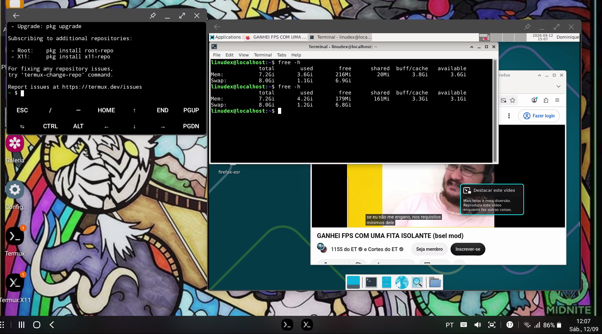

# Benchmarks

[English](benchmarks.md)

A validação inicial da v0.1 foi focada em cargas práticas de desktop, e não em pontuações de benchmarks sintéticos.

## Metodologia

- Debian 13 ARM64 executado através do PRoot-Distro.
- XFCE renderizado através do Termux:X11.
- Uso de CPU coletado pelo Android via ADB (`dumpsys cpuinfo`), pois as restrições do SELinux do Android impedem leituras globais confiáveis de CPU pelo `htop` dentro do PRoot.
- RAM coletada dentro do Debian com `free -h`.
- Temperatura da bateria coletada via ADB (`dumpsys battery`).
- Cada carga foi mantida tempo suficiente para estabilizar antes do registro dos valores.

A temperatura da bateria não corresponde à temperatura do SoC.

## Resultados

| Teste                        | RAM usada | RAM disponível | CPU total | Divisão da CPU          | Temp. bateria | Estabilidade |
| ---------------------------- | --------: | -------------: | --------: | ----------------------- | ------------: | ------------ |
| XFCE em idle                 |   3.4 GiB |        3.8 GiB |       10% | 4.9% user + 5.9% kernel |       27.8 °C | Estável      |
| XFCE + Firefox               |   3.4 GiB |        3.9 GiB |       13% | 6.0% user + 7.2% kernel |       29.8 °C | Estável      |
| Firefox + 5 abas             |   3.4 GiB |        3.8 GiB |       16% | 7.5% user + 8.3% kernel |       30.7 °C | Estável      |
| YouTube 1440p no Firefox ESR |   4.2 GiB |        3.1 GiB |       62% | 40% user + 22% kernel   |       33.0 °C | Estável      |

A RAM total reportada durante estes testes foi de aproximadamente 7.2 GiB.



## Observações

- Todas as cargas registradas na v0.1 permaneceram estáveis.
- YouTube em 1440p foi a carga mais pesada testada e produziu o maior aumento tanto no uso de CPU quanto no consumo de RAM.
- A temperatura da bateria permaneceu em 33.0 °C durante o teste de 1440p.
- Os resultados validam a pilha de software como prova de conceito utilizável, mas ainda não medem temperatura do SoC, eficiência da decodificação de vídeo por hardware ou throttling térmico de longa duração.
- Depois do aumento do limite de processos phantom do Android 12, os encerramentos aleatórios anteriores por `SIGKILL` (`signal 9`) deixaram de ser observados durante os testes.

## Métricas para preservar nos próximos testes

Para manter comparações consistentes, registre no mínimo:

```text
CPU total: XX%
RAM usada: X.X GiB
RAM disponível: X.X GiB
Temperatura da bateria: XX.X °C
Estabilidade: Estável / Instável
```

Para CPU, use a linha final `XX% TOTAL` de `adb shell dumpsys cpuinfo`. Para a temperatura da bateria, use o campo `temperature:` de `adb shell dumpsys battery` dividido por 10.
