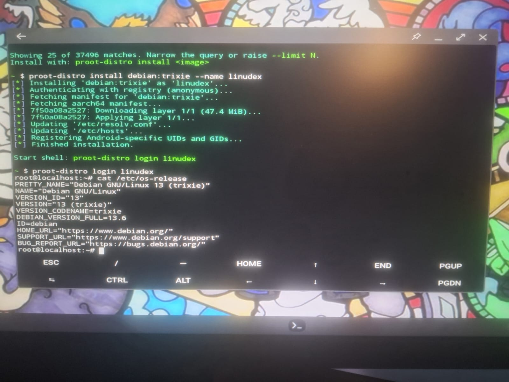
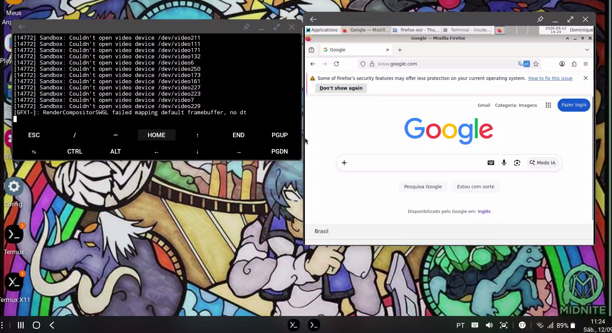
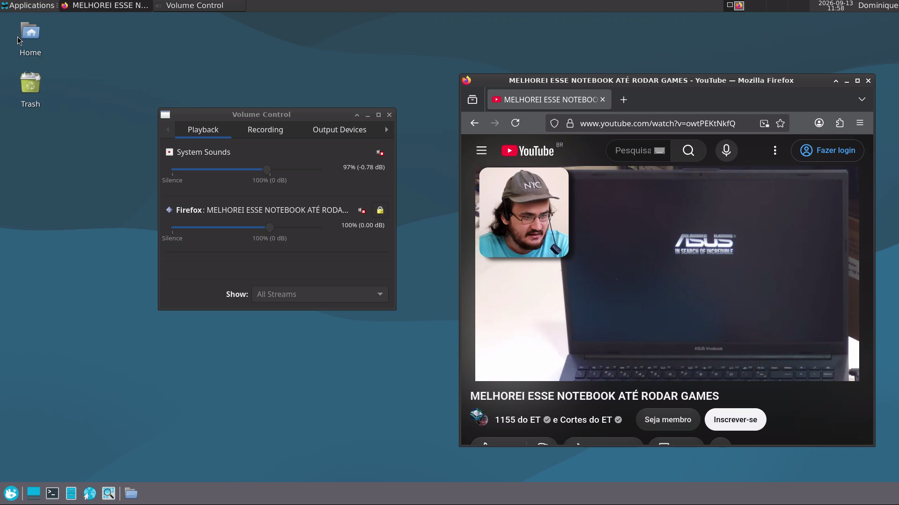
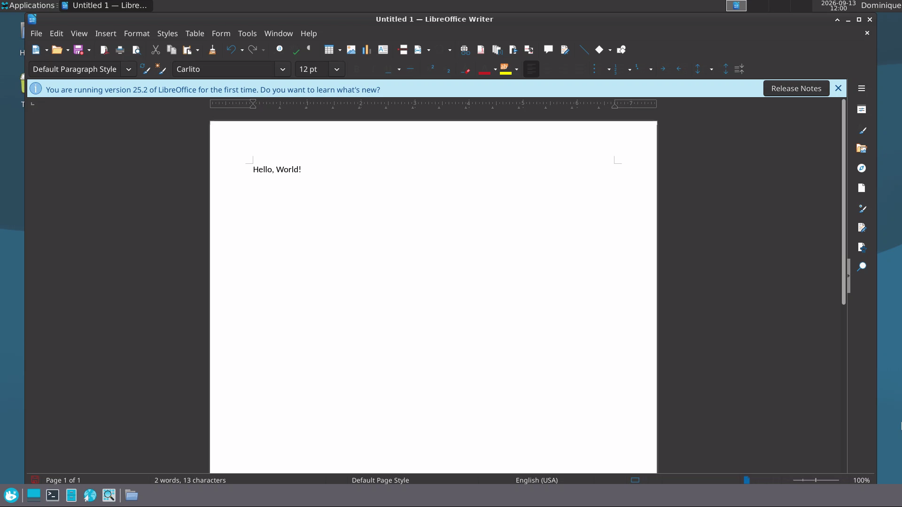

# Software Setup

[Português](software.pt.md)

This document records the software stack used by the Linudex v0.2.0 daily-driver milestone.

## Final v0.2.0 stack

```text
Android 12 / One UI 4.1
├── Samsung DeX
├── Termux:Boot
├── Termux:Widget
└── Termux (F-Droid build)
    ├── PulseAudio
    ├── Termux:X11
    └── PRoot-Distro
        └── Debian 13 ARM64 (`linudex`)
            └── XFCE
```

## 1. Termux host

Termux was installed from F-Droid. The host environment was updated and the core packages were installed through the project scripts. The v0.2.0 host requirements include:

```text
git
curl
wget
nano
openssh
proot-distro
x11-repo
termux-x11-nightly
pulseaudio
```

The device architecture was confirmed with:

```bash
uname -m
```

Expected architecture:

```text
aarch64
```

## 2. Debian installation

Debian 13 ARM64 was installed through PRoot-Distro with the local installation name `linudex`.

The environment is entered with:

```bash
proot-distro login linudex
```

The basic Debian setup included updating packages and installing common core utilities:

```bash
apt update
apt upgrade
apt install -y sudo git curl wget nano ca-certificates locales procps htop file unzip zip
```



## 3. Non-root desktop user

A dedicated user named `linudex` was created for normal desktop use.

Because PRoot-Distro login sessions did not expose the supplementary `sudo` group as expected, an explicit sudoers rule was added with `visudo`:

```text
linudex ALL=(ALL:ALL) ALL
```

The configuration was validated with:

```bash
sudo whoami
```

Expected result:

```text
root
```

See [Troubleshooting](troubleshooting.md) for the reason this was necessary.

## 4. XFCE

XFCE and D-Bus X11 support were installed inside Debian:

```bash
sudo apt update
sudo apt install -y xfce4 dbus-x11
```

The v0.2.0 desktop configuration uses:

- 1920×1080 Termux:X11 output.
- 115 DPI.
- XFCE compositor disabled.
- 40 px panel with Whisker Menu.
- Simplified desktop layout.
- `Ctrl+Alt+T` for `xfce4-terminal`.
- `Super+E` for Thunar.
- `Super+B` for Firefox ESR.

The corresponding reproducible configuration is kept under `configs/`.

## 5. Termux:X11

On the Termux side, the X11 repository and Termux:X11 command-line component are installed through the setup script. The matching Android Termux:X11 application is also required.

Because the main Termux installation came from F-Droid, the non-`sharedUid` Termux:X11 APK variant was used.

The v0.2.0 preferences use exact 1920×1080 output and fullscreen mode. The exported Termux:X11 preferences are stored under `configs/termux/`.

## 6. Graphical session startup

The normal v0.2.0 workflow uses `scripts/termux/start-linudex.sh` rather than manually entering each command.

The script starts the stack in this order:

```text
PulseAudio
    ↓
Termux:X11 server
    ↓
Termux:X11 Android Activity
    ↓
PRoot-Distro
    ↓
Debian as user `linudex`
    ↓
D-Bus
    ↓
XFCE
```

The underlying Debian session still uses a shared temporary directory and `DISPLAY=:1`.



## 7. Shared Android storage

Android shared storage was enabled from Termux and exposed to the Debian user as `~/AndroidStorage`.

This provides a practical file exchange path between Android/DeX and the Debian desktop without copying files through ADB or network services.

## 8. Audio integration

PulseAudio runs on the Termux side and exposes a local TCP server. Debian applications use:

```text
PULSE_SERVER=tcp:127.0.0.1
```

The resulting path is:

```text
Debian application
       ↓
PulseAudio client
       ↓
tcp:127.0.0.1
       ↓
Termux PulseAudio
       ↓
Android / DeX audio
```

Audio was validated with Firefox ESR and the PulseAudio Volume Control interface.



## 9. Essential applications

The v0.2.0 daily-driver environment includes:

- Firefox ESR.
- Evince.
- VLC.
- Ristretto.
- Mousepad.
- Galculator.
- Xarchiver and Thunar archive integration.
- LibreOffice Writer, Calc and Impress.
- Brazilian Portuguese LibreOffice localization and spell checking.
- Carlito, Caladea, Liberation and Noto fonts for improved document compatibility.

The package list is automated by `scripts/debian/install-apps.sh`.



## 10. Automatic startup and manual control

Termux:Boot is used to start Linudex automatically after Android boot. The boot script waits for `sys.boot_completed`, allows the graphical environment to settle and then runs `start-linudex.sh`.

The boot process writes to:

```text
~/linudex-boot.log
```

Because Android can restrict Activities started from the background, Termux was granted the **Appear on top** permission so the Termux:X11 Activity can open automatically during boot.

Termux:Widget provides manual `Start-Linudex` and `Stop-Linudex` shortcuts for cases where the Debian environment needs to be started or stopped from Android/DeX.

## 11. Android host tuning

For the v0.2.0 environment:

- Termux and Termux:X11 are configured without battery restrictions.
- RAM Plus is set to 8 GB. This is storage-backed virtual memory, not physical RAM.
- Charging is capped at 85% to reduce battery wear during stationary use.
- Android Developer Options **Logger buffer size** is set to **Disabled**.
- Android Developer Options **Accelerated processing** is enabled.
- Android 12's phantom-process limit is increased during testing after repeated `signal 9` process termination. See [Troubleshooting](troubleshooting.md).

The logger-buffer and accelerated-processing options are documented as host tuning choices; no isolated benchmark was performed to attribute a quantified performance gain to either option.

## 12. Current v0.2.0 limitations

- The current Phantom Process Killer workaround uses temporary `until_reboot` behavior and may need to be reapplied after a device reboot.
- Final keyboard layout validation depends on the physical keyboard.
- Final mouse tuning and display scaling should be validated again with the definitive monitor/hub setup.
- Automatic cold boot directly into the final Samsung DeX HDMI setup still requires hardware validation.
- The physical enclosure and active-cooling build belong to the hardware phase.
