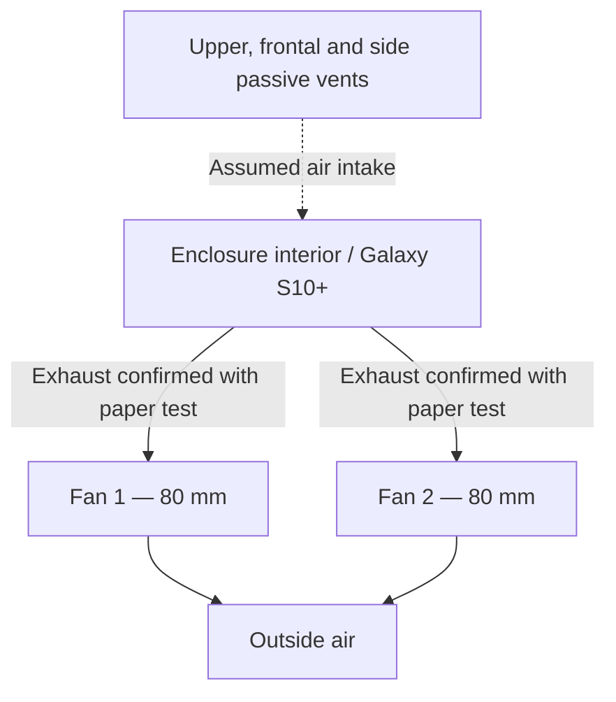

```mermaid
flowchart TB
    A["Upper, frontal and side passive vents"] -.->|"Assumed air intake"| I["Enclosure interior / Galaxy S10+"]
    I -->|"Exhaust confirmed with paper test"| F1["Fan 1 — 80 mm"]
    I -->|"Exhaust confirmed with paper test"| F2["Fan 2 — 80 mm"]
    F1 --> E["Outside air"]
    F2 --> E
```
