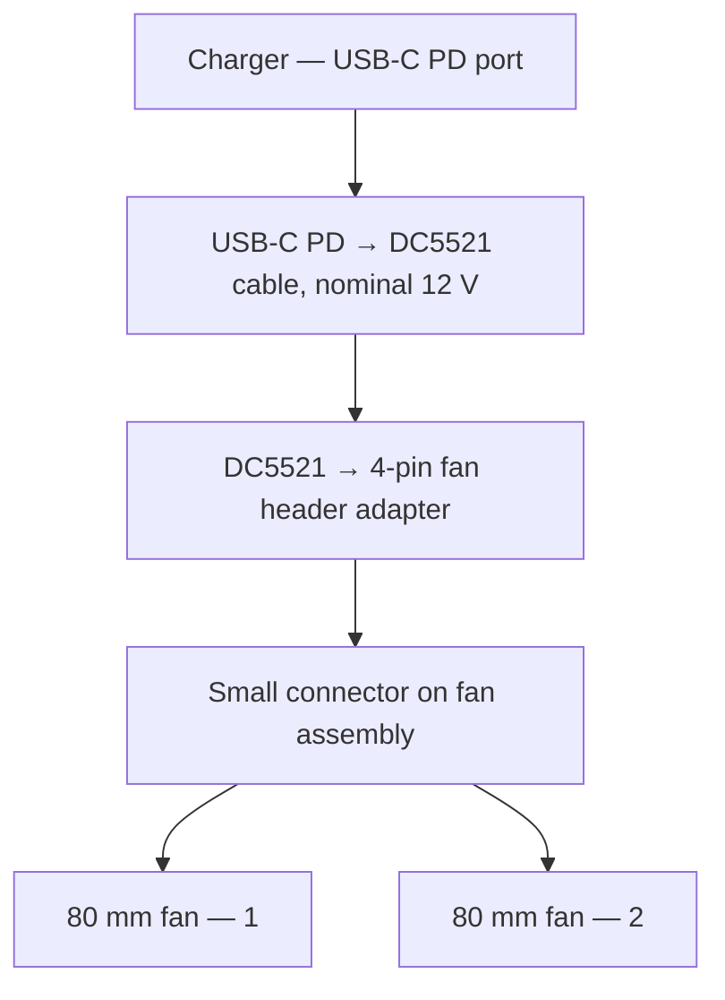

```mermaid
flowchart TD
    C["Charger — USB-C PD port"]
    T["USB-C PD → DC5521 cable, nominal 12 V"]
    A["DC5521 → 4-pin fan header adapter"]
    F["Small connector on fan assembly"]
    F1["80 mm fan — 1"]
    F2["80 mm fan — 2"]
    C --> T --> A --> F
    F --> F1
    F --> F2
```
