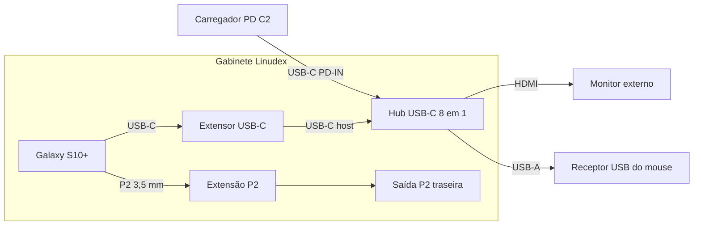

```mermaid
flowchart LR
subgraph Gabinete["Gabinete Linudex"]
S["Galaxy S10+"]
E["Extensor USB-C"]
H["Hub USB-C 8 em 1"]
P["Extensão P2"]
J["Saída P2 traseira"]

        S -->|"USB-C"| E
        E -->|"USB-C host"| H
        S -->|"P2 3,5 mm"| P
        P --> J
    end

    C["Carregador PD C2"] -->|"USB-C PD-IN"| H
    H -->|"HDMI"| M["Monitor externo"]
    H -->|"USB-A"| R["Receptor USB do mouse"]

```
