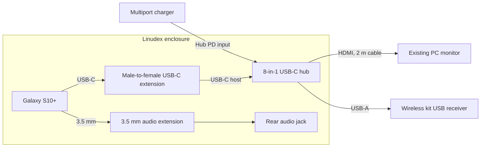

```mermaid
flowchart LR
    subgraph Enclosure["Linudex enclosure"]
        S["Galaxy S10+"]
        E["Male-to-female USB-C extension"]
        H["8-in-1 USB-C hub"]
        P["3.5 mm audio extension"]
        J["Rear audio jack"]
        S -->|"USB-C"| E
        E -->|"USB-C host"| H
        S -->|"3.5 mm"| P
        P --> J
    end
    C["Multiport charger"] -->|"Hub PD input"| H
    H -->|"HDMI, 2 m cable"| M["Existing PC monitor"]
    H -->|"USB-A"| R["Wireless kit USB receiver"]
```
